# 01 Configuración

## Configurar el Entorno

- **Tiempo de ejecución**: Bun  
- **Gestor de paquetes**: Bun  

## ¿Por qué usar Bun?

- Más eficiente que NPM.  
- Permite ejecutar TypeScript con importaciones ES6 de manera sencilla.  
- Menos problemas de dependencias en comparación con NPM.  

## Comandos Básicos

- `bun run dev`: Inicia el servidor de desarrollo.  
- `bun run build`: Compila el proyecto.  
- `bunx === npx`: Ejecuta paquetes de manera similar a `npx`.  

---

# 02 Diseño Básico  

## Estructura Visual  

  - Agregar un logo y un panel de control básico.  
  - Aprender la estructura de carpetas del enrutador de la aplicación.  

---

## - **Imagen**:  
  

## Barra Lateral  

- **Secciones de la Barra Lateral**:  
  - Elementos de la barra lateral.  
  - Enlaces de la barra lateral.  
  - Acciones dentro de la barra lateral.  

- **Otras Secciones**:  
  - Campo de búsqueda.  
  - Componentes de autenticación.  

---

# 03 Autenticación  

- Integrar Clerk.  
- Agregar pantallas de inicio de sesión.  
- Incluir el `userButton`.  
- Añadir middleware.  
- Usar el estado de autenticación en las secciones de la barra lateral.  
- Proteger rutas.  

## - **Imagen**:  
  
  
  

---

# 04 Configurando base de datos 

- Creado un PostgreAQL database *(www.neon.tech)*.
- Configurando DrizzleORM.
- Creando un schema para la base de datos
- Migrando los cambios a la base de datos
## - **Imagen**: 

## ¿Por qué DrizzleORM?

- Compatibilidad con múltiples bases de datos (PostgreSQL, MySQL, SQLite)
- Único ORM con soporte para SQL relacional y consultas tipo SQL-like.
- Optimizado para entornos serverless por defecto.
- Forza a escribir consultas explícitas, mejorando la comprensión del código.

---

# 05 Configurando Webhook sync 

- crear una cuenta ngrok( permite exponer un servidor local a Internet mediante túneles seguros "Https")
- obtener un dominio estatico(no requerido)
- agregar script al local run y la app( ver Package.json )

- crear los usuarios webhook
- conectar la webhook a el dashboard de clerk 

## - ** configurando  webhook para subir al usuario a la base de datos  **:
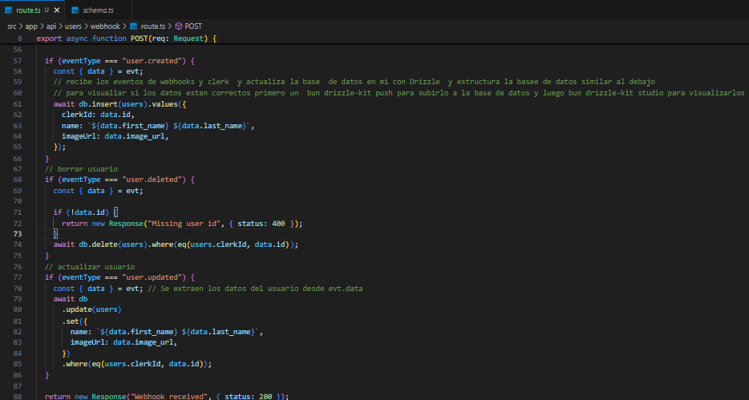

---

## - ** Usuario guardado Drizzle**:

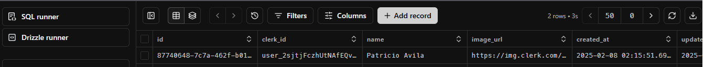

---

# 06 Instalando TRPC( esta es una librería que permite comunicar el frontend y el backend sin necesidad de definir APIs REST)

## ¿Por qué TRPC 

- Elimina la necesidad de definir manualmente endpoints en el backend.
- Integración sencilla con Next.js, Express, y otros frameworks.
- Menos código repetitivo en validaciones y respuestas.
- Ecosistema ligero sin dependencias innecesarias.  
- Hook familiares (use  query, useMutation etc)
[Para la instalacion sigue la siguiente documentacion](https://trpc.io/docs/client/react/server-components)

## - **Imagen**: 

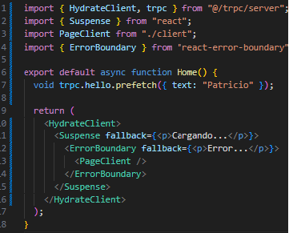

--- 

# 07 Configurando TRP para nuestro projecto

- Agrega auth al contexto tRPC
- Agrega procedimientos protegidos
- Agrega una limitacion a la tasa de peticiones usando redis

--- 

## - **Configurando autentificacion del usuario**: 

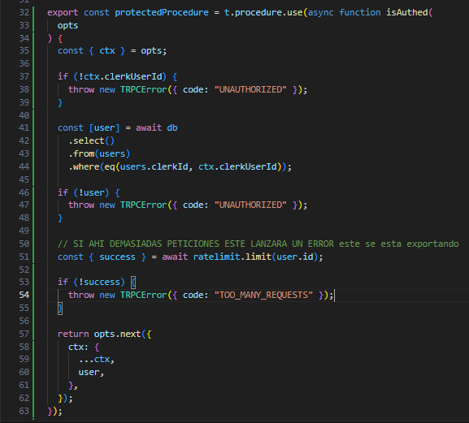

- 🔹 Protege los endpoints de la API para que solo los usuarios autenticados puedan acceder.
- 🔹 Evita ataques de fuerza bruta o abusos mediante rate limiting.
- 🔹 Añade datos del usuario al contexto, facilitando el acceso en otras partes del código.

# 08 Categoria de videos

- agregar un schema para crear las categorias
- push para cambiar las categorias en la base de datos
- sembrar seed para las  categorias
- Organizar las rutas tRPC
- obtener fetch de las categorias
- crear un componente para mostrar las categorias

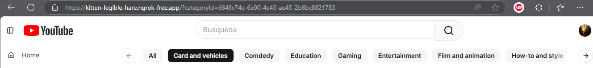

# 09 Layout studio

- crear ruta para de studio
- crear un layout studio
- proteger las rutas de studio

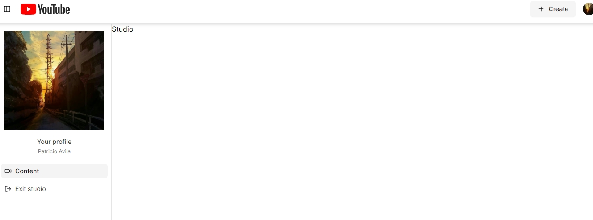

# 10 video Studio

- Crear un schema ara los videos
- push para cambiar los videos en la base de datos
- crear  un procedimiento para el studio
- agregar creacion de grabacion de video

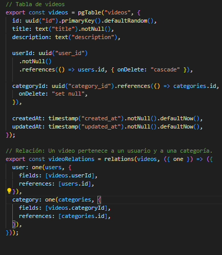
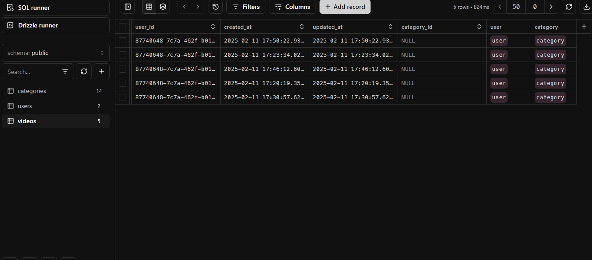
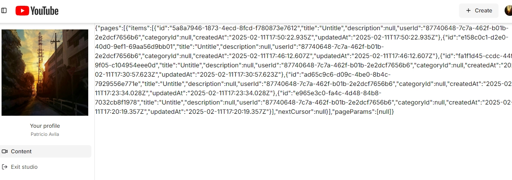

# 11 Infinite loading

- Agregar suspense y error boundaries
- crear un infiniteScroll componente y que sea reutilizable
- demostrar el infintte scroll 

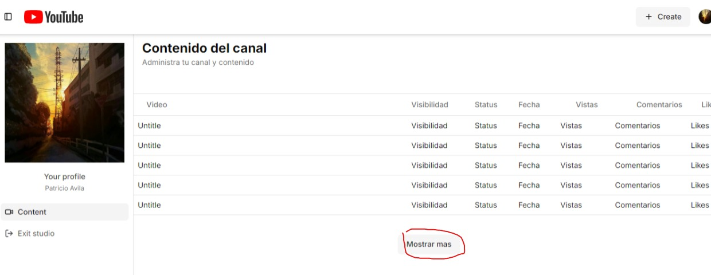
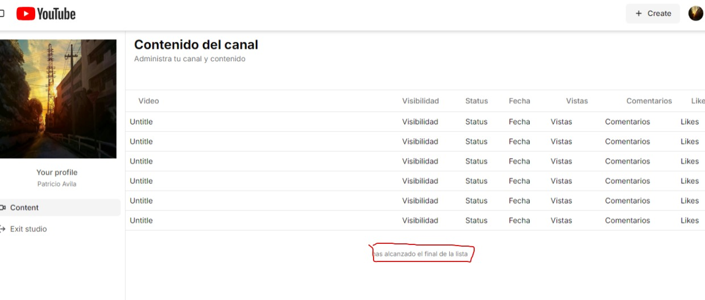

# 12 integracion de Mux

- Create un responsivo modelo
- crear una cuenta de Mux
- crear un procedimiento para subir el video a Mux
- crear un uplaod mdoal para subir el video

--- 

# mux tiene un limite de almacenamiento en torno a que borrara lso videos despues de 24 horas

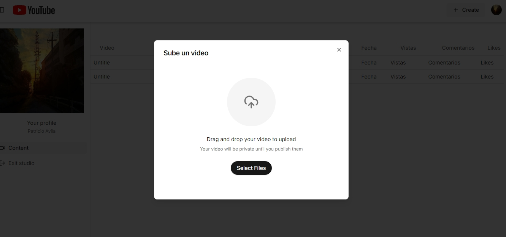