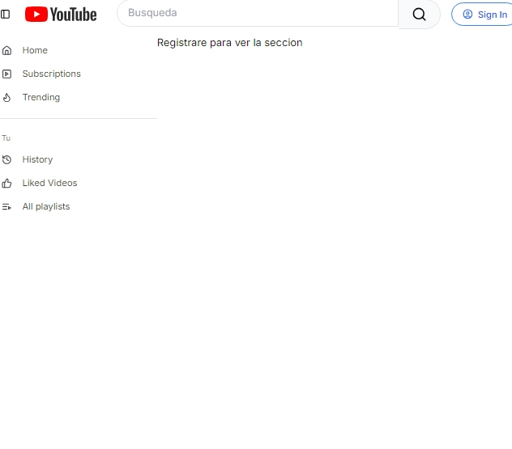
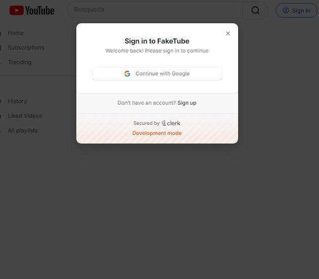
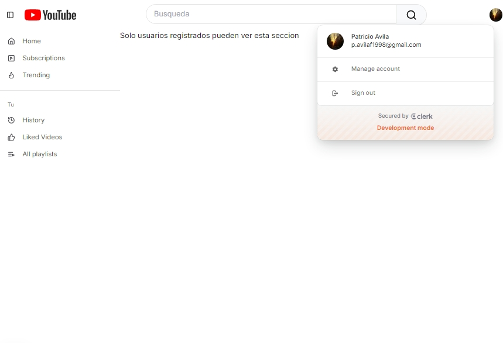
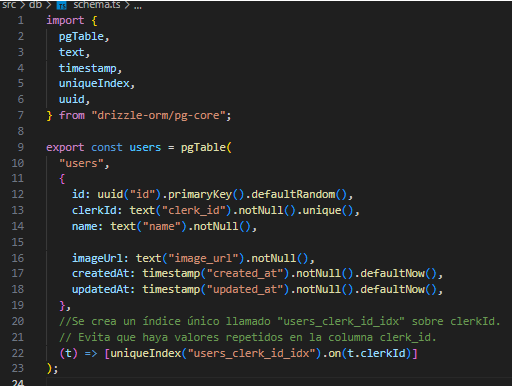

# 01 Configuración

## Configurar el Entorno

- **Tiempo de ejecución**: Bun  
- **Gestor de paquetes**: Bun  

## ¿Por qué usar Bun?

- Más eficiente que NPM.  
- Permite ejecutar TypeScript con importaciones ES6 de manera sencilla.  
- Menos problemas de dependencias en comparación con NPM.  

## Comandos Básicos

- `bun run dev`: Inicia el servidor de desarrollo.  
- `bun run build`: Compila el proyecto.  
- `bunx === npx`: Ejecuta paquetes de manera similar a `npx`.  

---

# 02 Diseño Básico  

## Estructura Visual  

  - Agregar un logo y un panel de control básico.  
  - Aprender la estructura de carpetas del enrutador de la aplicación.  

---

## - **Imagen**:  
  

## Barra Lateral  

- **Secciones de la Barra Lateral**:  
  - Elementos de la barra lateral.  
  - Enlaces de la barra lateral.  
  - Acciones dentro de la barra lateral.  

- **Otras Secciones**:  
  - Campo de búsqueda.  
  - Componentes de autenticación.  

---

# 03 Autenticación  

- Integrar Clerk.  
- Agregar pantallas de inicio de sesión.  
- Incluir el `userButton`.  
- Añadir middleware.  
- Usar el estado de autenticación en las secciones de la barra lateral.  
- Proteger rutas.  

## - **Imagen**:  
  
  
  

---

# 04 Configurando base de datos 

- Creado un PostgreAQL database *(www.neon.tech)*.
- Configurando DrizzleORM.
- Creando un schema para la base de datos
- Migrando los cambios a la base de datos
## - **Imagen**: 

## ¿Por qué DrizzleORM?

- solo ORM con ambos tipos relanionales y SQL-like query APIS
- serveless por defecto
- nos fuerza a entender nuestras querys

---

# 05 Configurando Webhook sync 

- crear una cuenta ngrok
- obtener un dominio estatico(no requerido)
- agregar script al local run y la app
- crear los usuarios webhook
- conectar la webhook a el dashboard de clerk 

